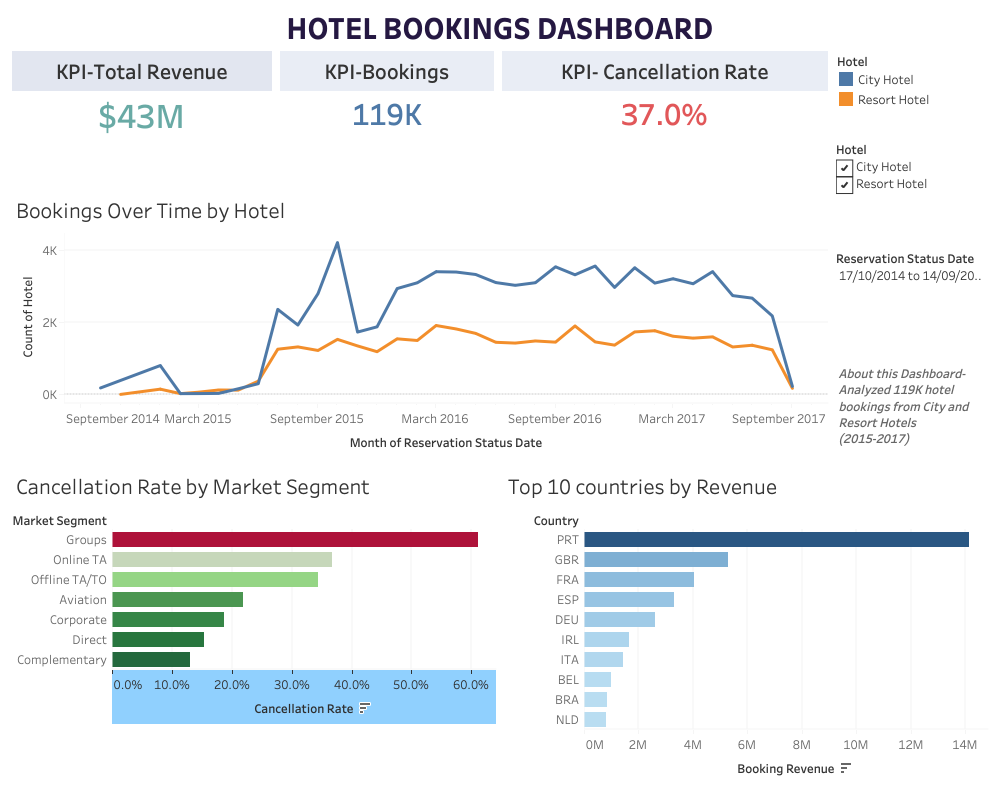
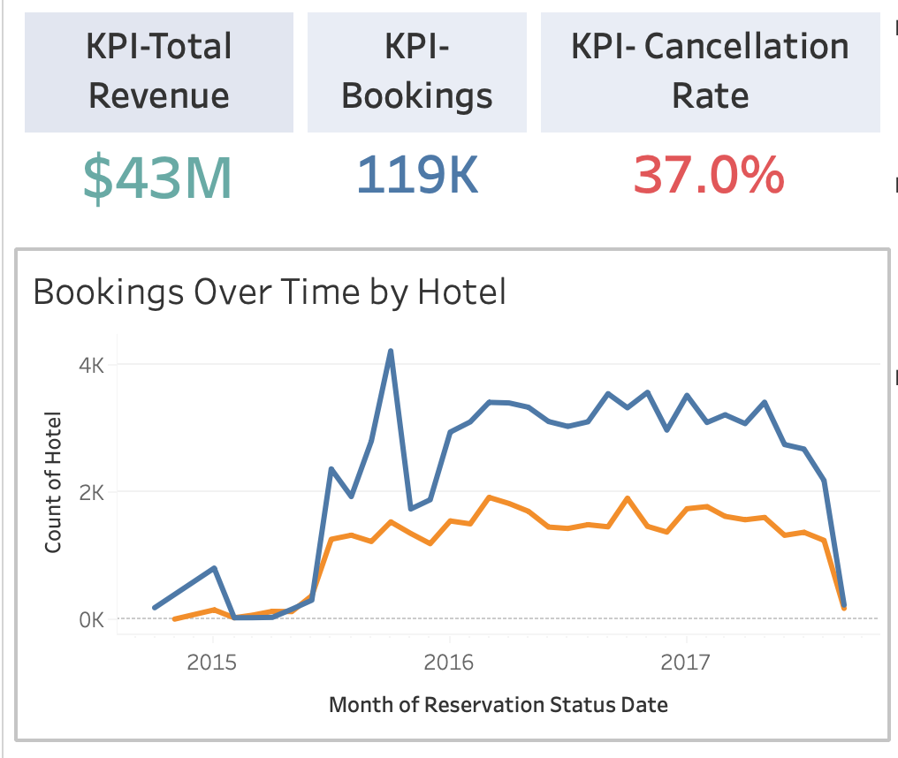
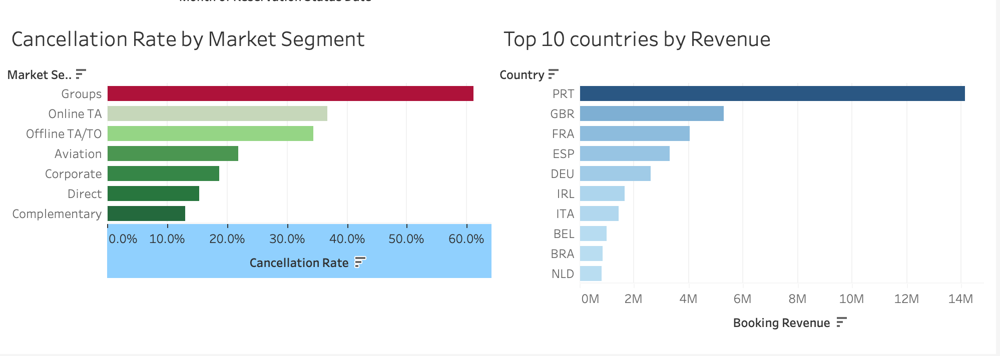

# Hotel Booking Customer Segmentation & Cancellation Risk Analysis
 
A multi-layered analysis of 119,388 real hotel bookings combining Python and SQL exploratory analysis with an interactive Tableau dashboard. Identifies which customer segments and acquisition channels drive disproportionate cancellation risk, surfaces a data quality finding that reframes the headline numbers, and translates findings into PM-facing recommendations.
 

 
## The Question
 
A hotel chain's revenue team is losing significant capacity to cancellations. Forecasts overshoot. Rooms get held but never sold. Operational planning suffers.
 
**Which customer segments are eroding the revenue, and what's the dollar impact of intervening on the worst ones?**
 
## The Answer
 
**37% of bookings cancel.** Not random churn, but a structural revenue problem driven by specific channel and lead-time combinations. The more interesting finding is what the cross-tabbed data shows: the channel with the worst cancellation rate is not the channel with the worst absolute revenue loss. The two metrics point at different intervention targets.
 
## What's in This Repository
 
This project has two layers:
 
**1. Python and SQL analysis** (in `notebooks/`)
 
The deeper analytical work: exploratory analysis, cross-tab segmentation, revenue quantification, a data quality investigation, and three production SQL queries with CTEs and window functions. Ends with a PM-facing decision memo and methodological gaps section.
 
**2. Tableau dashboard** (`Hotel_Bookings_Dashboard.twbx`)
 
The visualization layer: an interactive dashboard with KPI tiles, booking trends, segment cancellation rates, and country revenue concentration. Built with global filters for hotel type and date range.
 
## Headline Findings
 
- **Overall cancellation rate: 37%** across 119K bookings

- **Highest-risk segment combination:** Groups channel + 365+ day lead time at **80% cancellation rate**

- **Largest absolute revenue exposure:** Online TA channel at ~€10.2M in cancelled revenue (volume-driven, not rate-driven)

- **Loyalty signal:** Repeat guests cancel at **14% vs 38% for first-timers**, less than half the rate

- **Data quality investigation:** Non Refund deposit type shows 99% cancellation, with 97% concentrated in Groups and Offline TA channels, suggesting B2B wholesale block-release behavior rather than individual deposit forfeiture
 
Full analytical narrative and decision memo in the notebook.
 
## Tableau Dashboard Sections
 
### Headline Metrics

Three KPI tiles surface the most important numbers at a glance: total revenue, total bookings, and overall cancellation rate.
 
### Booking Trends

A time-series chart comparing booking volume between City and Resort hotels over the three-year period.
 

 
### Detail Analysis

The bottom row breaks down cancellation risk by market segment and revenue concentration by country.
 

 
## Interactive Features
 
- **Hotel filter:** toggle between Resort Hotel, City Hotel, or both

- **Date range filter:** slider to focus on any time window from 2014 to 2017

- **Global filtering:** selecting in one filter updates every chart simultaneously
 
## Calculated Fields
 
| Field | Formula | Purpose |

|---|---|---|

| **Cancellation Rate** | `SUM([Is Canceled]) / COUNT([Hotel])` | Used as a KPI and in segment analysis |
 
## Methodology
 
| Step | Approach |

|------|----------|

| Baseline metrics | Overall cancellation rate, missing data audit, derived columns |

| Single-variable segmentation | Cancellation rate by market segment, lead time bucket, deposit type, repeat guest |

| Multi-dimensional segmentation | Channel × lead-time cross-tab to surface intersection effects |

| Revenue impact | ADR × total nights, separated by realized vs cancelled, ranked by absolute exposure |

| Data quality investigation | Non-Refund anomaly traced to B2B booking behavior conflation |

| SQL implementation | DuckDB queries with CTEs, window functions, conditional aggregation |

| Visualization | Three matplotlib charts in notebook plus interactive Tableau dashboard (.twbx) |

| Communication | Decision memo with TL;DR, findings, recommendations, limitations, and v2 gaps |
 
## Tools
 
Python · pandas · numpy · matplotlib · SQL via DuckDB · Tableau Desktop
 
## Dataset
 
[Hotel Booking Demand](https://www.kaggle.com/datasets/jessemostipak/hotel-booking-demand) by Jesse Mostipak on Kaggle, sourced from Antonio, Almeida & Nunes (2019). 119,388 booking records covering one city hotel and one resort hotel in Portugal, 2014–2017. 32 columns in the raw dataset, expanded to 38 after feature engineering (lead time buckets, total nights, booking revenue, risk flags).
 
## How to Use This Repo
 
**To explore the analysis:** Open `notebooks/hotel-booking-customer-segmentation-cancellation.ipynb` directly in GitHub's notebook viewer, or download and run locally.
 
**To open the dashboard:** Download `Hotel_Bookings_Dashboard.twbx` and open with Tableau Desktop or the free Tableau Reader. All data is packaged inside.
 
## What This Project Demonstrates
 
- **Multi-dimensional thinking.** The cross-tab analysis (channel × lead time) reveals risk patterns that single-variable cuts hide.

- **Rate vs absolute dollar reasoning.** The Online TA finding (€10.2M absolute loss despite moderate rate) shows the kind of nuance that separates analysts who report metrics from analysts who frame business decisions.

- **Data quality skepticism.** The Non-Refund anomaly investigation surfaced a structural data labeling issue. Most analyses would have reported the 99% rate at face value.

- **SQL fluency on production patterns.** CTEs, window functions, conditional aggregation, HAVING filters.

- **End-to-end communication.** Analysis in Python and SQL, decision memo for PMs, Tableau dashboard for ongoing monitoring.
 
## About
 
Built by **Jaskirat Kaur**, an analyst focused on customer behavior, segmentation, and translating quantitative findings into business decisions.
 
Connect: [LinkedIn](https://linkedin.com/in/jaskirat-kaur23) · [GitHub](https://github.com/jaskiratkaur23)
 